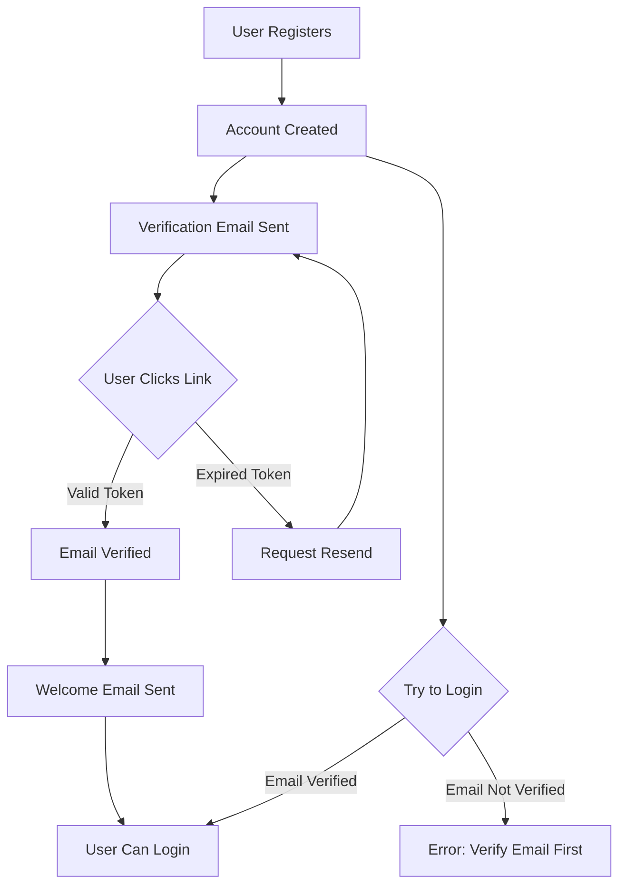

# 📧 Email Verification System Guide

## Overview

Complete email verification system that requires users to verify their email address before they can log in. The system sends beautiful HTML emails with verification links and includes features like resend verification and welcome emails.

---

## 🎯 Features

✅ **Email Verification Required** - Users must verify email before login  
✅ **Beautiful HTML Emails** - Professional email templates  
✅ **24-Hour Token Expiry** - Verification links expire after 24 hours  
✅ **Resend Verification** - Users can request new verification emails  
✅ **Welcome Email** - Sent automatically after verification  
✅ **Multiple Email Providers** - Supports Gmail, SMTP, etc.  
✅ **Frontend Redirect** - Auto-redirect to frontend after verification  
✅ **Swagger Documentation** - All endpoints documented

---

## 🔄 Email Verification Flow



---

## 📋 API Endpoints

### 1. Register User (Sends Verification Email)

**Endpoint:** `POST /api/v1/auth/register`  
**Authentication:** Not Required

**Request Body:**

```json
{
  "username": "johndoe",
  "email": "john@example.com",
  "password": "password123"
}
```

**Response:**

```json
{
  "message": "User registered",
  "user": {
    "id": "64abc123def456789",
    "username": "johndoe",
    "email": "john@example.com",
    "role": "user",
    "isEmailVerified": false,
    "message": "Registration successful! Please check your email to verify your account."
  }
}
```

**What Happens:**

1. ✅ User account created
2. ✅ Verification token generated (32-byte random hex)
3. ✅ Token expires in 24 hours
4. ✅ Verification email sent to user
5. ✅ User receives email with verification link

---

### 2. Verify Email

**Endpoint:** `GET /api/v1/auth/verify-email/:token`  
**Authentication:** Not Required

**Parameters:**

- `token` (path) - Email verification token from email
- `redirect` (query, optional) - If 'false', returns JSON instead of redirecting

**Example URLs:**

```bash
# Auto-redirect to frontend (default)
GET http://localhost:3000/api/v1/auth/verify-email/abc123def456...

# Return JSON response
GET http://localhost:3000/api/v1/auth/verify-email/abc123def456...?redirect=false
```

**Response (JSON mode):**

```json
{
  "success": true,
  "message": "Email verified successfully! You can now log in.",
  "user": {
    "id": "64abc123def456789",
    "username": "johndoe",
    "email": "john@example.com",
    "isEmailVerified": true
  }
}
```

**Response (Redirect mode - default):**

- Success: Redirects to `{FRONTEND_URL}/email-verified?success=true`
- Error: Redirects to `{FRONTEND_URL}/email-verified?success=false&error=...`

**What Happens:**

1. ✅ Token validated
2. ✅ Email marked as verified
3. ✅ Token cleared from database
4. ✅ Welcome email sent
5. ✅ User can now login

**Error Response:**

```json
{
  "success": false,
  "message": "Invalid or expired verification token"
}
```

---

### 3. Resend Verification Email

**Endpoint:** `POST /api/v1/auth/resend-verification`  
**Authentication:** Not Required

**Request Body:**

```json
{
  "email": "john@example.com"
}
```

**Response:**

```json
{
  "success": true,
  "message": "Verification email sent! Please check your inbox."
}
```

**What Happens:**

1. ✅ New verification token generated
2. ✅ Old token replaced
3. ✅ New expiry time set (24 hours)
4. ✅ New verification email sent

**Error Responses:**

**User Not Found:**

```json
{
  "success": false,
  "message": "User not found"
}
```

**Already Verified:**

```json
{
  "success": false,
  "message": "Email is already verified"
}
```

---

### 4. Login (Checks Email Verification)

**Endpoint:** `POST /api/v1/auth/login`  
**Authentication:** Not Required

**Request Body:**

```json
{
  "email": "john@example.com",
  "password": "password123"
}
```

**Success Response (Email Verified):**

```json
{
  "message": "Login successful",
  "accessToken": "eyJhbGciOiJIUzI1NiIsInR5cCI6IkpXVCJ9...",
  "refreshToken": "eyJhbGciOiJIUzI1NiIsInR5cCI6IkpXVCJ9...",
  "user": {
    "id": "64abc123def456789",
    "username": "johndoe",
    "email": "john@example.com",
    "role": "user",
    "isEmailVerified": true
  }
}
```

**Error Response (Email Not Verified):**

```json
{
  "message": "Please verify your email before logging in. Check your inbox for the verification link."
}
```

---

## ⚙️ Email Configuration

### Environment Variables

Add these to your `.env` files:

**For Gmail:**

```env
# Email Configuration
EMAIL_SERVICE=gmail
EMAIL_HOST=smtp.gmail.com
EMAIL_PORT=587
EMAIL_SECURE=false
EMAIL_USER=your_email@gmail.com
EMAIL_PASSWORD=your_app_password
EMAIL_FROM_NAME=Online Shopping

# URL Configuration
FRONTEND_URL=http://localhost:3000
BACKEND_URL=http://localhost:3000
```

**For Other SMTP Services:**

```env
EMAIL_SERVICE=smtp
EMAIL_HOST=smtp.yourdomain.com
EMAIL_PORT=587
EMAIL_SECURE=false
EMAIL_USER=noreply@yourdomain.com
EMAIL_PASSWORD=your_smtp_password
EMAIL_FROM_NAME=Online Shopping

FRONTEND_URL=https://yourdomain.com
BACKEND_URL=https://api.yourdomain.com
```

---

### Gmail Setup (App Password)

If using Gmail, you need to create an **App Password**:

1. **Enable 2-Factor Authentication**

   - Go to Google Account → Security
   - Enable 2-Step Verification

2. **Generate App Password**

   - Go to Google Account → Security → 2-Step Verification
   - Scroll to "App passwords"
   - Select "Mail" and "Other (Custom name)"
   - Enter "Online Shopping Backend"
   - Click "Generate"
   - Copy the 16-character password
   - Use this in `EMAIL_PASSWORD`

3. **Update Environment Variables**

```env
EMAIL_SERVICE=gmail
EMAIL_USER=your_email@gmail.com
EMAIL_PASSWORD=abcd efgh ijkl mnop  # 16-character app password
```

---

## 📧 Email Templates

### Verification Email

**Subject:** ✅ Verify Your Email - Online Shopping

**Features:**

- 🎨 Beautiful gradient header
- 📱 Mobile responsive
- 🔘 Clear call-to-action button
- ⚠️ Security warning about expiry
- 🔗 Fallback text link

**Preview:**

```
┌─────────────────────────────────┐
│   🎉 Welcome to Online Shopping!   │
│        (Gradient Header)            │
├─────────────────────────────────┤
│ Hi johndoe! 👋                     │
│                                     │
│ Thank you for registering...        │
│                                     │
│   [✅ Verify Email Address]         │
│                                     │
│ ⚠️ Link expires in 24 hours        │
└─────────────────────────────────┘
```

---

### Welcome Email

**Subject:** 🎉 Welcome to Online Shopping!

**Sent:** After successful email verification

**Features:**

- 🎊 Celebratory design
- 📋 Next steps guide
- 🛍️ Feature highlights
- 🚀 Call to action

---

## 🧪 Testing

### 1. Test Registration Flow

```bash
# Register new user
POST http://localhost:3000/api/v1/auth/register
Headers: Content-Type: application/json
Body:
{
  "username": "testuser",
  "email": "test@example.com",
  "password": "password123"
}

# Response should indicate email sent
# Check your email inbox for verification link
```

### 2. Test Email Verification

**Option A: Click Link in Email**

- Open email
- Click "Verify Email Address" button
- Should redirect to frontend with success message

**Option B: API Call**

```bash
GET http://localhost:3000/api/v1/auth/verify-email/YOUR_TOKEN_HERE?redirect=false

# Response:
{
  "success": true,
  "message": "Email verified successfully! You can now log in."
}
```

### 3. Test Login (Before Verification)

```bash
POST http://localhost:3000/api/v1/auth/login
Body:
{
  "email": "test@example.com",
  "password": "password123"
}

# Should return error:
{
  "message": "Please verify your email before logging in..."
}
```

### 4. Test Login (After Verification)

```bash
# After verifying email
POST http://localhost:3000/api/v1/auth/login
Body:
{
  "email": "test@example.com",
  "password": "password123"
}

# Should return access token
{
  "message": "Login successful",
  "accessToken": "...",
  "refreshToken": "..."
}
```

### 5. Test Resend Verification

```bash
POST http://localhost:3000/api/v1/auth/resend-verification
Body:
{
  "email": "test@example.com"
}

# Response:
{
  "success": true,
  "message": "Verification email sent! Please check your inbox."
}
```

---

## 🎨 Frontend Integration

### React Example - Registration

```jsx
import { useState } from "react";

function RegisterForm() {
  const [formData, setFormData] = useState({
    username: "",
    email: "",
    password: "",
  });
  const [message, setMessage] = useState("");

  const handleSubmit = async (e) => {
    e.preventDefault();

    try {
      const response = await fetch(
        "http://localhost:3000/api/v1/auth/register",
        {
          method: "POST",
          headers: { "Content-Type": "application/json" },
          body: JSON.stringify(formData),
        }
      );

      const data = await response.json();

      if (response.ok) {
        setMessage("✅ " + data.user.message);
        // Show verification pending screen
      } else {
        setMessage("❌ " + data.message);
      }
    } catch (error) {
      setMessage("❌ Registration failed");
    }
  };

  return (
    <form onSubmit={handleSubmit}>
      <input
        type="text"
        placeholder="Username"
        value={formData.username}
        onChange={(e) => setFormData({ ...formData, username: e.target.value })}
      />
      <input
        type="email"
        placeholder="Email"
        value={formData.email}
        onChange={(e) => setFormData({ ...formData, email: e.target.value })}
      />
      <input
        type="password"
        placeholder="Password"
        value={formData.password}
        onChange={(e) => setFormData({ ...formData, password: e.target.value })}
      />
      <button type="submit">Register</button>
      {message && <p>{message}</p>}
    </form>
  );
}
```

---

### Email Verification Success Page

```jsx
import { useEffect, useState } from "react";
import { useSearchParams, useNavigate } from "react-router-dom";

function EmailVerified() {
  const [searchParams] = useSearchParams();
  const navigate = useNavigate();
  const [status, setStatus] = useState("loading");

  useEffect(() => {
    const success = searchParams.get("success");
    const error = searchParams.get("error");

    if (success === "true") {
      setStatus("success");
      // Redirect to login after 3 seconds
      setTimeout(() => navigate("/login"), 3000);
    } else {
      setStatus("error");
    }
  }, [searchParams, navigate]);

  if (status === "loading") {
    return <div>Verifying email...</div>;
  }

  if (status === "success") {
    return (
      <div className="success-page">
        <h1>✅ Email Verified!</h1>
        <p>Your email has been successfully verified.</p>
        <p>Redirecting to login...</p>
      </div>
    );
  }

  return (
    <div className="error-page">
      <h1>❌ Verification Failed</h1>
      <p>{searchParams.get("error") || "Invalid or expired link"}</p>
      <ResendVerificationForm />
    </div>
  );
}
```

---

### Resend Verification Component

```jsx
function ResendVerificationForm() {
  const [email, setEmail] = useState("");
  const [message, setMessage] = useState("");

  const handleResend = async (e) => {
    e.preventDefault();

    try {
      const response = await fetch(
        "http://localhost:3000/api/v1/auth/resend-verification",
        {
          method: "POST",
          headers: { "Content-Type": "application/json" },
          body: JSON.stringify({ email }),
        }
      );

      const data = await response.json();
      setMessage(data.message);
    } catch (error) {
      setMessage("Failed to resend email");
    }
  };

  return (
    <div>
      <h3>Resend Verification Email</h3>
      <form onSubmit={handleResend}>
        <input
          type="email"
          placeholder="Enter your email"
          value={email}
          onChange={(e) => setEmail(e.target.value)}
          required
        />
        <button type="submit">Resend Email</button>
      </form>
      {message && <p>{message}</p>}
    </div>
  );
}
```

---

## 🔒 Security Features

✅ **Cryptographically Secure Tokens** - 32-byte random tokens  
✅ **Token Expiration** - 24-hour validity  
✅ **One-Time Use** - Tokens cleared after verification  
✅ **Email Validation** - Regex pattern matching  
✅ **Login Protection** - Cannot login without verification

---

## 🐛 Troubleshooting

### Email Not Sending

**Issue:** Verification email not received

**Solutions:**

1. Check spam/junk folder
2. Verify EMAIL_USER and EMAIL_PASSWORD in .env
3. For Gmail: Ensure App Password is used (not regular password)
4. Check console logs for email errors
5. Verify SMTP settings are correct

**Test Email Configuration:**

```bash
# Check server logs after registration
# Should see: ✅ Verification email sent: <message-id>
# If error: ❌ Failed to send verification email: <error>
```

---

### Token Expired

**Issue:** "Invalid or expired verification token"

**Solution:**

- Request new verification email using resend endpoint
- Tokens expire after 24 hours

```bash
POST /api/v1/auth/resend-verification
Body: { "email": "user@example.com" }
```

---

### Gmail "Less Secure App" Error

**Issue:** Gmail blocking login

**Solution:**

- Don't use "Allow less secure apps" (deprecated)
- Use App Password instead (see Gmail Setup section above)

---

## 📊 Database Schema

### User Model Updates

```javascript
{
  username: String,
  email: String,
  password: String,
  role: String,

  // ✨ New Email Verification Fields
  isEmailVerified: {
    type: Boolean,
    default: false
  },
  emailVerificationToken: {
    type: String,
    default: null
  },
  emailVerificationExpires: {
    type: Date,
    default: null
  },

  createdAt: Date,
  updatedAt: Date
}
```

---

## 🎯 Best Practices

1. **Always Use HTTPS in Production** - Protect verification tokens
2. **Set Appropriate Token Expiry** - 24 hours is recommended
3. **Clear Tokens After Use** - Prevent replay attacks
4. **Send Welcome Email** - Improve user engagement
5. **Provide Resend Option** - Better user experience
6. **Log Email Failures** - Monitor delivery issues
7. **Use Professional Email Templates** - Build trust

---

## 🚀 Future Enhancements

- [ ] Email verification reminder (after 48 hours)
- [ ] Account deletion for unverified users (after 7 days)
- [ ] SMS verification option
- [ ] Social login (OAuth)
- [ ] Email change verification
- [ ] Multi-language email templates

---

## 📚 Related Documentation

- **Swagger Docs:** http://localhost:3000/api-docs
- **Authentication Guide:** See `/api-docs` → Authentication section

---

**Last Updated:** 2025-10-18  
**Version:** 1.0.0  
**Status:** ✅ Production Ready
