# 🔐 OTP-Based Registration System

## Overview

Complete OTP (One-Time Password) based email verification system. Users receive a **6-digit OTP** via email, verify it, and then their account is created. No user account exists until OTP is successfully verified.

---

## 🎯 Key Features

✅ **Two-Step Registration** - Request OTP → Verify OTP → Account Created  
✅ **6-Digit OTP** - Easy to type, secure verification code  
✅ **10-Minute Expiry** - OTP expires after 10 minutes  
✅ **5 Attempts Limit** - Prevents brute force attacks  
✅ **Beautiful Email Template** - Professional OTP email design  
✅ **Pending User Storage** - Temporary storage before verification  
✅ **Auto-Cleanup** - Expired pending users auto-deleted  
✅ **Resend OTP** - Request new OTP if expired  
✅ **Welcome Email** - Sent after successful verification  

---

## 🔄 Registration Flow

```mermaid
graph TB
    A[User Submits Registration Form] --> B{Check if Email/Username Exists}
    B -->|Exists| C[Error: User already exists]
    B -->|New User| D[Generate 6-Digit OTP]
    D --> E[Save to PendingUser Collection]
    E --> F[Send OTP Email]
    F --> G[User Receives Email]
    G --> H[User Enters OTP]
    H --> I{Verify OTP}
    I -->|Invalid| J[Error: Wrong OTP]
    I -->|Expired| K[Error: OTP Expired - Resend]
    I -->|Valid| L[Create User Account]
    L --> M[Delete from PendingUser]
    M --> N[Send Welcome Email]
    N --> O[✅ Registration Complete]
```



---

## 📋 API Endpoints

### 1. Request OTP (Step 1)

**Endpoint:** `POST /api/v1/auth/request-otp`  
**Authentication:** Not Required

**Request Body:**
```json
{
  "username": "johndoe",
  "email": "john@example.com",
  "password": "password123"
}
```

**Response:**
```json
{
  "success": true,
  "message": "OTP sent to your email. Please verify to complete registration.",
  "email": "john@example.com",
  "expiresIn": "10 minutes"
}
```

**What Happens:**
1. ✅ Checks if email/username already exists
2. ✅ Generates 6-digit OTP (e.g., "123456")
3. ✅ Saves user data + OTP to `PendingUser` collection (temporary)
4. ✅ Sends OTP via email
5. ✅ User has 10 minutes to verify

**Error Responses:**

**User Already Exists:**
```json
{
  "success": false,
  "msg": "User already exists with this email or username"
}
```

**Email Send Failed:**
```json
{
  "success": false,
  "msg": "Failed to send OTP email. Please try again."
}
```

---

### 2. Verify OTP (Step 2)

**Endpoint:** `POST /api/v1/auth/verify-otp`  
**Authentication:** Not Required

**Request Body:**
```json
{
  "email": "john@example.com",
  "otp": "123456"
}
```

**Success Response:**
```json
{
  "success": true,
  "message": "Email verified successfully! Your account has been created.",
  "user": {
    "id": "64abc123def456789",
    "username": "johndoe",
    "email": "john@example.com",
    "role": "user",
    "isEmailVerified": true
  }
}
```

**What Happens:**
1. ✅ Validates OTP
2. ✅ Creates actual user account (password hashed)
3. ✅ Sets `isEmailVerified: true`
4. ✅ Deletes pending user record
5. ✅ Sends welcome email
6. ✅ User can now login

**Error Responses:**

**No Pending Registration:**
```json
{
  "success": false,
  "msg": "No pending registration found for this email"
}
```

**OTP Expired:**
```json
{
  "success": false,
  "msg": "OTP has expired. Please request a new one."
}
```

**Invalid OTP:**
```json
{
  "success": false,
  "msg": "Invalid OTP. 4 attempts remaining."
}
```

**Too Many Attempts:**
```json
{
  "success": false,
  "msg": "Too many failed attempts. Please request a new OTP."
}
```

---

### 3. Resend OTP

**Endpoint:** `POST /api/v1/auth/resend-otp`  
**Authentication:** Not Required

**Request Body:**
```json
{
  "email": "john@example.com"
}
```

**Response:**
```json
{
  "success": true,
  "message": "New OTP sent to your email",
  "expiresIn": "10 minutes"
}
```

**What Happens:**
1. ✅ Generates new 6-digit OTP
2. ✅ Updates pending user record
3. ✅ Resets attempt counter
4. ✅ Sends new OTP email

**Error Response:**
```json
{
  "success": false,
  "message": "No pending registration found for this email"
}
```

---

### 4. Login (After Verification)

**Endpoint:** `POST /api/v1/auth/login`  
**Authentication:** Not Required

**Request Body:**
```json
{
  "email": "john@example.com",
  "password": "password123"
}
```

**Success Response:**
```json
{
  "msg": "Login successful",
  "accessToken": "eyJhbGciOiJIUzI1NiIsInR5cCI6IkpXVCJ9...",
  "refreshToken": "eyJhbGciOiJIUzI1NiIsInR5cCI6IkpXVCJ9...",
  "user": {
    "id": "64abc123def456789",
    "username": "johndoe",
    "email": "john@example.com",
    "role": "user",
    "isEmailVerified": true
  }
}
```

---

## 📧 OTP Email Template

### Email Preview

**Subject:** 🔐 Your Verification Code - Online Shopping

```
┌─────────────────────────────────┐
│    🔐 Email Verification        │
│      (Gradient Header)           │
├─────────────────────────────────┤
│ Hi johndoe! 👋                  │
│                                  │
│ Your Verification Code:          │
│                                  │
│  ┌─────────────────┐            │
│  │   1 2 3 4 5 6   │            │
│  │  (Large, Bold)  │            │
│  └─────────────────┘            │
│                                  │
│ ⚠️ Important:                   │
│ • Expires in 10 minutes          │
│ • Don't share with anyone        │
│                                  │
└─────────────────────────────────┘
```

### Email Features
- ✅ Large, easy-to-read OTP code
- ✅ Clear expiry warning
- ✅ Mobile responsive
- ✅ Professional design
- ✅ Security tips

---

## 💾 Database Models

### PendingUser Model (Temporary)

```javascript
{
  username: String,
  email: String (indexed),
  password: String (plain text, not hashed yet),
  role: String,
  otp: String (6-digit),
  otpExpires: Date (indexed for auto-delete),
  attempts: Number (max 5),
  createdAt: Date,
  updatedAt: Date
}
```

**Auto-Cleanup:** Documents deleted 15 minutes after `otpExpires`

### User Model (Permanent)

```javascript
{
  username: String,
  email: String,
  password: String (hashed),
  role: String,
  isEmailVerified: Boolean (true after OTP verification),
  emailOTP: String (null - reserved for future use),
  emailOTPExpires: Date (null),
  createdAt: Date,
  updatedAt: Date
}
```

---

## 🧪 Testing

### Complete Flow Test

**Step 1: Request OTP**
```bash
POST http://localhost:3000/api/v1/auth/request-otp
Content-Type: application/json

{
  "username": "testuser",
  "email": "test@example.com",
  "password": "password123"
}

# Response:
{
  "success": true,
  "message": "OTP sent to your email...",
  "expiresIn": "10 minutes"
}

# Check your email for 6-digit OTP
```

**Step 2: Verify OTP**
```bash
POST http://localhost:3000/api/v1/auth/verify-otp
Content-Type: application/json

{
  "email": "test@example.com",
  "otp": "123456"
}

# Response:
{
  "success": true,
  "message": "Email verified successfully! Your account has been created.",
  "user": { ... }
}
```

**Step 3: Login**
```bash
POST http://localhost:3000/api/v1/auth/login
Content-Type: application/json

{
  "email": "test@example.com",
  "password": "password123"
}

# Response:
{
  "msg": "Login successful",
  "accessToken": "...",
  "refreshToken": "..."
}
```

---

### Test Invalid OTP

```bash
POST http://localhost:3000/api/v1/auth/verify-otp
Content-Type: application/json

{
  "email": "test@example.com",
  "otp": "000000"
}

# Response:
{
  "success": false,
  "msg": "Invalid OTP. 4 attempts remaining."
}
```

---

### Test Resend OTP

```bash
POST http://localhost:3000/api/v1/auth/resend-otp
Content-Type: application/json

{
  "email": "test@example.com"
}

# Response:
{
  "success": true,
  "message": "New OTP sent to your email",
  "expiresIn": "10 minutes"
}
```

---

## 🎨 Frontend Integration

### React Example - Registration Form

```jsx
import { useState } from 'react';

function RegisterForm() {
  const [step, setStep] = useState(1); // 1: Form, 2: OTP
  const [formData, setFormData] = useState({
    username: '',
    email: '',
    password: ''
  });
  const [otp, setOtp] = useState('');
  const [message, setMessage] = useState('');
  const [loading, setLoading] = useState(false);

  // Step 1: Request OTP
  const handleRegister = async (e) => {
    e.preventDefault();
    setLoading(true);

    try {
      const response = await fetch('http://localhost:3000/api/v1/auth/request-otp', {
        method: 'POST',
        headers: { 'Content-Type': 'application/json' },
        body: JSON.stringify(formData)
      });

      const data = await response.json();

      if (response.ok) {
        setMessage('✅ OTP sent to ' + formData.email);
        setStep(2); // Show OTP input
      } else {
        setMessage('❌ ' + data.msg);
      }
    } catch (error) {
      setMessage('❌ Failed to send OTP');
    } finally {
      setLoading(false);
    }
  };

  // Step 2: Verify OTP
  const handleVerifyOTP = async (e) => {
    e.preventDefault();
    setLoading(true);

    try {
      const response = await fetch('http://localhost:3000/api/v1/auth/verify-otp', {
        method: 'POST',
        headers: { 'Content-Type': 'application/json' },
        body: JSON.stringify({
          email: formData.email,
          otp: otp
        })
      });

      const data = await response.json();

      if (response.ok) {
        setMessage('✅ ' + data.message);
        // Redirect to login
        setTimeout(() => window.location.href = '/login', 2000);
      } else {
        setMessage('❌ ' + data.msg);
      }
    } catch (error) {
      setMessage('❌ Verification failed');
    } finally {
      setLoading(false);
    }
  };

  // Resend OTP
  const handleResendOTP = async () => {
    try {
      const response = await fetch('http://localhost:3000/api/v1/auth/resend-otp', {
        method: 'POST',
        headers: { 'Content-Type': 'application/json' },
        body: JSON.stringify({ email: formData.email })
      });

      const data = await response.json();
      setMessage(data.success ? '✅ ' + data.message : '❌ ' + data.message);
    } catch (error) {
      setMessage('❌ Failed to resend OTP');
    }
  };

  return (
    <div className="register-form">
      {step === 1 ? (
        // Step 1: Registration Form
        <form onSubmit={handleRegister}>
          <h2>Create Account</h2>
          <input
            type="text"
            placeholder="Username"
            value={formData.username}
            onChange={(e) => setFormData({...formData, username: e.target.value})}
            required
          />
          <input
            type="email"
            placeholder="Email"
            value={formData.email}
            onChange={(e) => setFormData({...formData, email: e.target.value})}
            required
          />
          <input
            type="password"
            placeholder="Password"
            value={formData.password}
            onChange={(e) => setFormData({...formData, password: e.target.value})}
            required
            minLength={6}
          />
          <button type="submit" disabled={loading}>
            {loading ? 'Sending OTP...' : 'Send OTP'}
          </button>
          {message && <p>{message}</p>}
        </form>
      ) : (
        // Step 2: OTP Verification
        <form onSubmit={handleVerifyOTP}>
          <h2>Verify Email</h2>
          <p>Enter the 6-digit code sent to {formData.email}</p>
          <input
            type="text"
            placeholder="Enter OTP"
            value={otp}
            onChange={(e) => setOtp(e.target.value.replace(/\D/g, '').slice(0, 6))}
            maxLength={6}
            pattern="\d{6}"
            required
            style={{ fontSize: '24px', letterSpacing: '8px', textAlign: 'center' }}
          />
          <button type="submit" disabled={loading || otp.length !== 6}>
            {loading ? 'Verifying...' : 'Verify OTP'}
          </button>
          <button type="button" onClick={handleResendOTP}>
            Resend OTP
          </button>
          {message && <p>{message}</p>}
        </form>
      )}
    </div>
  );
}

export default RegisterForm;
```

---

## 🔒 Security Features

✅ **OTP Expiration** - 10 minutes validity  
✅ **Attempt Limiting** - Max 5 incorrect attempts  
✅ **Rate Limiting** - Prevents spam (implement separately)  
✅ **Auto-Cleanup** - Expired pending users deleted  
✅ **No User Until Verified** - Account created only after OTP  
✅ **Password Hashing** - Bcrypt hashing after verification  
✅ **Email-OTP Binding** - OTP tied to specific email  

---

## ⏱️ Timeouts & Limits

| Item | Value | Purpose |
|------|-------|---------|
| OTP Length | 6 digits | Easy to type, 1M combinations |
| OTP Expiry | 10 minutes | Balance security & UX |
| Max Attempts | 5 | Prevent brute force |
| Pending User TTL | 15 min after expiry | Auto-cleanup |
| Resend Delay | None (but limited by expiry) | UX flexibility |

---

## 🐛 Common Issues & Solutions

### Issue: OTP Email Not Received
**Solutions:**
- Check spam/junk folder
- Verify EMAIL_USER and EMAIL_PASSWORD in .env
- Check server logs for email errors
- Verify email service configuration

### Issue: "Invalid OTP" Error
**Solutions:**
- Check OTP carefully (case-sensitive)
- Ensure OTP hasn't expired (10 min limit)
- Request new OTP if needed
- Check attempt counter (max 5)

### Issue: "No pending registration found"
**Solutions:**
- Request new OTP (previous may have expired)
- Verify email address matches registration
- Check if already registered

### Issue: User Can't Login After Verification
**Solutions:**
- Verify `isEmailVerified: true` in database
- Check password is correct
- Clear pending user records manually if stuck

---

## 📊 Comparison: OTP vs Link

| Feature | OTP-Based | Link-Based |
|---------|-----------|------------|
| User Experience | ✅ Quick, no browser switch | ❌ Click link, switch context |
| Mobile Friendly | ✅✅ Copy-paste OTP | ✅ Click link |
| Security | ✅ Short-lived, attempts limited | ✅ Long token |
| Complexity | Medium | Low |
| User Preference | Modern, familiar | Traditional |

---

## 🎯 Best Practices

1. **Clear Communication** - Show remaining time, attempts
2. **Resend Option** - Always provide resend button
3. **Large OTP Input** - Make it easy to enter
4. **Auto-Submit** - Submit when 6 digits entered
5. **Error Messages** - Clear, actionable feedback
6. **Mobile Optimization** - Numeric keyboard for OTP
7. **Email Design** - Large, clear OTP display

---

## 🚀 Future Enhancements

- [ ] SMS OTP option (Twilio integration)
- [ ] Rate limiting on OTP requests
- [ ] TOTP/2FA for login
- [ ] Backup codes
- [ ] Remember device option
- [ ] Analytics (OTP success rate)

---

## 📚 Related Documentation

- **Quick Start:** [`EMAIL_SETUP_QUICK_START.md`](EMAIL_SETUP_QUICK_START.md)
- **Email Config:** [`.env.email.example`](.env.email.example)
- **Swagger Docs:** http://localhost:3000/api-docs

---

**Last Updated:** 2025-10-18  
**Version:** 2.0.0 (OTP-Based)  
**Status:** ✅ Production Ready
