# ⭐ Star Rating System Guide

## Overview

Automatic star rating system that calculates and displays average ratings for both **Products** and **Variants** based on customer reviews. The ratings update automatically whenever reviews are added, updated, or deleted.

---

## 🎯 Features

✅ **Automatic Rating Calculation** - Updates when reviews change  
✅ **Dual-Level Ratings** - Both product and variant ratings  
✅ **Review Count Tracking** - Total reviews displayed  
✅ **Real-time Updates** - Instant rating refresh on review changes  
✅ **Filter by Rating** - Query products with minimum rating  
✅ **Sort by Rating** - Order products by highest rating or most reviewed  
✅ **Variant-Specific Ratings** - Each variant has its own rating  

---

## 📊 How It Works

### Rating Calculation Flow

```mermaid
graph TB
    A[Customer Adds Review] --> B[Review Saved to Database]
    B --> C[Update Variant Rating]
    C --> D[Calculate Avg from All Variant Reviews]
    D --> E[Save to Variant Model]
    E --> F[Update Product Rating]
    F --> G[Calculate Avg from All Product Variants' Reviews]
    G --> H[Save to Product Model]
    H --> I[✅ Ratings Updated]
```



### Example Calculation

**Product: Nike Air Max 270**
- Variant 1 (Size 42, Black): 5 reviews → Avg: 4.6 ⭐
- Variant 2 (Size 43, White): 3 reviews → Avg: 4.3 ⭐
- Variant 3 (Size 44, Red): 2 reviews → Avg: 5.0 ⭐

**Product Overall Rating**: (4.6 + 4.3 + 5.0 + 4.6 + 4.3 + 5.0 + 4.6 + 4.3 + 5.0 + 5.0) / 10 = **4.67** ⭐  
**Total Reviews**: 10

---

## 💾 Database Schema

### Product Model
```javascript
{
  name: String,
  description: String,
  category: String,
  tags: [String],
  basePrice: Number,
  averageRating: Number (0-5),  // ⭐ Auto-calculated
  totalReviews: Number,         // ⭐ Auto-calculated
  createdAt: Date,
  updatedAt: Date
}
```

### Variant Model
```javascript
{
  productId: ObjectId (ref: Product),
  color: String,
  size: String,
  price: Number,
  stock: Number,
  sku: String,
  images: [String],
  averageRating: Number (0-5),  // ⭐ Auto-calculated
  totalReviews: Number,         // ⭐ Auto-calculated
  createdAt: Date,
  updatedAt: Date
}
```

### Review Model
```javascript
{
  userId: ObjectId (ref: User),
  variantId: ObjectId (ref: Variant),
  orderId: ObjectId (ref: Order),
  rating: Number (1-5),
  review: String,
  createdAt: Date,
  updatedAt: Date
}
```

---

## 🔄 Automatic Rating Updates

Ratings update automatically on these events:

### 1. When Review is Added
```javascript
POST /api/v1/review/add
→ Creates review
→ Updates variant rating
→ Updates product rating
```

### 2. When Review is Updated
```javascript
PUT /api/v1/review/my-review/:reviewId
→ Updates review rating
→ Recalculates variant rating
→ Recalculates product rating
```

### 3. When Review is Deleted
```javascript
DELETE /api/v1/review/my-review/:reviewId
→ Deletes review
→ Recalculates variant rating (excluding deleted review)
→ Recalculates product rating
```

---

## 🔗 API Endpoints with Ratings

### Get All Products with Ratings

**Endpoint:** `GET /api/v1/product/all`

**Query Parameters:**
- `category` (optional) - Filter by category
- `minRating` (optional) - Minimum average rating (0-5)
- `sortBy` (optional) - Sort by: `rating`, `reviews`, or `newest`

**Example Requests:**

```bash
# Get all products
GET http://localhost:3000/api/v1/product/all

# Get products with rating >= 4
GET http://localhost:3000/api/v1/product/all?minRating=4

# Get products sorted by highest rating
GET http://localhost:3000/api/v1/product/all?sortBy=rating

# Get Clothing products with rating >= 4.5
GET http://localhost:3000/api/v1/product/all?category=Clothing&minRating=4.5&sortBy=rating
```

**Response Example:**
```json
{
  "success": true,
  "totalProducts": 3,
  "products": [
    {
      "_id": "64abc123def456788",
      "name": "Nike Air Max 270",
      "description": "Premium running shoes",
      "category": "Shoes",
      "averageRating": 4.67,
      "totalReviews": 10,
      "tags": ["running", "sports"],
      "createdAt": "2025-10-01T10:00:00.000Z",
      "updatedAt": "2025-10-18T12:00:00.000Z"
    },
    {
      "_id": "64abc123def456799",
      "name": "Adidas Ultraboost",
      "description": "Comfort running shoes",
      "category": "Shoes",
      "averageRating": 4.3,
      "totalReviews": 5,
      "createdAt": "2025-10-05T14:00:00.000Z",
      "updatedAt": "2025-10-17T09:00:00.000Z"
    }
  ]
}
```

---

### Get Single Product with Variants

**Endpoint:** `GET /api/v1/product/:productId`

**Response Example:**
```json
{
  "success": true,
  "product": {
    "_id": "64abc123def456788",
    "name": "Nike Air Max 270",
    "description": "Premium running shoes",
    "category": "Shoes",
    "averageRating": 4.67,
    "totalReviews": 10,
    "createdAt": "2025-10-01T10:00:00.000Z"
  },
  "variants": [
    {
      "_id": "64abc123def456790",
      "productId": "64abc123def456788",
      "size": "42",
      "color": "Black",
      "price": 12999,
      "stock": 25,
      "averageRating": 4.6,
      "totalReviews": 5,
      "images": ["https://cloudinary.com/image1.jpg"]
    },
    {
      "_id": "64abc123def456791",
      "productId": "64abc123def456788",
      "size": "43",
      "color": "White",
      "price": 12999,
      "stock": 30,
      "averageRating": 4.3,
      "totalReviews": 3,
      "images": ["https://cloudinary.com/image2.jpg"]
    }
  ],
  "totalVariants": 2
}
```

---

### Get Variant by ID

**Endpoint:** `GET /api/v1/product/variant/:variantId`

**Response Example:**
```json
{
  "success": true,
  "variant": {
    "_id": "64abc123def456790",
    "productId": {
      "_id": "64abc123def456788",
      "name": "Nike Air Max 270",
      "description": "Premium running shoes",
      "category": "Shoes",
      "averageRating": 4.67,
      "totalReviews": 10
    },
    "size": "42",
    "color": "Black",
    "price": 12999,
    "stock": 25,
    "sku": "NIKE-AM270-BLK-42",
    "averageRating": 4.6,
    "totalReviews": 5,
    "images": ["https://cloudinary.com/image1.jpg"],
    "createdAt": "2025-10-01T10:30:00.000Z",
    "updatedAt": "2025-10-18T12:00:00.000Z"
  }
}
```

---

### Get Variant Reviews with Average

**Endpoint:** `GET /api/v1/review/variant/:variantId`

**Response Example:**
```json
{
  "success": true,
  "totalReviews": 5,
  "averageRating": 4.6,
  "reviews": [
    {
      "_id": "64abc123def456795",
      "userId": {
        "_id": "64abc123def456789",
        "username": "john_doe"
      },
      "variantId": "64abc123def456790",
      "orderId": "64abc123def456791",
      "rating": 5,
      "review": "Excellent shoes! Very comfortable.",
      "createdAt": "2025-10-16T09:00:00.000Z"
    },
    {
      "_id": "64abc123def456796",
      "userId": {
        "_id": "64abc123def456800",
        "username": "jane_smith"
      },
      "variantId": "64abc123def456790",
      "orderId": "64abc123def456801",
      "rating": 4,
      "review": "Good quality, worth the price",
      "createdAt": "2025-10-15T14:20:00.000Z"
    }
  ]
}
```

---

## 🎨 Frontend Display Examples

### React Component - Star Rating Display

```jsx
function StarRating({ rating, totalReviews }) {
  const fullStars = Math.floor(rating);
  const hasHalfStar = rating % 1 >= 0.5;
  const emptyStars = 5 - fullStars - (hasHalfStar ? 1 : 0);

  return (
    <div className="star-rating">
      {/* Full stars */}
      {[...Array(fullStars)].map((_, i) => (
        <span key={`full-${i}`}>⭐</span>
      ))}
      
      {/* Half star */}
      {hasHalfStar && <span>⭐</span>}
      
      {/* Empty stars */}
      {[...Array(emptyStars)].map((_, i) => (
        <span key={`empty-${i}`}>☆</span>
      ))}
      
      <span className="rating-text">
        {rating.toFixed(1)} ({totalReviews} reviews)
      </span>
    </div>
  );
}

// Usage
<StarRating rating={4.6} totalReviews={23} />
// Output: ⭐⭐⭐⭐⭐ 4.6 (23 reviews)
```

### Product Card with Rating

```jsx
function ProductCard({ product }) {
  return (
    <div className="product-card">
      
      <h3>{product.name}</h3>
      <p>{product.description}</p>
      
      <div className="rating-section">
        <StarRating 
          rating={product.averageRating} 
          totalReviews={product.totalReviews} 
        />
      </div>
      
      <div className="price">₹{product.basePrice}</div>
      <button>View Details</button>
    </div>
  );
}
```

### Filter Products by Rating

```jsx
function ProductList() {
  const [products, setProducts] = useState([]);
  const [minRating, setMinRating] = useState(0);

  const fetchProducts = async () => {
    const url = minRating > 0 
      ? `http://localhost:3000/api/v1/product/all?minRating=${minRating}&sortBy=rating`
      : `http://localhost:3000/api/v1/product/all?sortBy=rating`;
      
    const response = await fetch(url);
    const data = await response.json();
    setProducts(data.products);
  };

  useEffect(() => {
    fetchProducts();
  }, [minRating]);

  return (
    <div>
      <h2>Products</h2>
      
      {/* Rating Filter */}
      <div className="filters">
        <label>Minimum Rating:</label>
        <select value={minRating} onChange={(e) => setMinRating(e.target.value)}>
          <option value="0">All Ratings</option>
          <option value="4">4+ Stars</option>
          <option value="4.5">4.5+ Stars</option>
          <option value="5">5 Stars Only</option>
        </select>
      </div>

      {/* Product Grid */}
      <div className="product-grid">
        {products.map(product => (
          <ProductCard key={product._id} product={product} />
        ))}
      </div>
    </div>
  );
}
```

---

## 🧪 Testing the Rating System

### Test Flow

1. **Create a Product with Variants**
```bash
POST http://localhost:3000/api/v1/product/create
# Upload product with variants
```

2. **Place and Deliver an Order**
```bash
POST http://localhost:3000/api/v1/orders/create
# Update order status to "delivered"
```

3. **Add First Review**
```bash
POST http://localhost:3000/api/v1/review/add
Headers: Authorization: Bearer <token>
Body:
{
  "variantId": "64abc123def456790",
  "orderId": "64abc123def456791",
  "rating": 5,
  "review": "Excellent product!"
}
```

4. **Check Variant Rating**
```bash
GET http://localhost:3000/api/v1/product/variant/64abc123def456790
# Should show: averageRating: 5, totalReviews: 1
```

5. **Check Product Rating**
```bash
GET http://localhost:3000/api/v1/product/64abc123def456788
# Should show: averageRating: 5, totalReviews: 1
```

6. **Add More Reviews**
```bash
# Add rating 4
POST http://localhost:3000/api/v1/review/add
Body: { "rating": 4, ... }

# Check variant again
GET http://localhost:3000/api/v1/product/variant/64abc123def456790
# Should show: averageRating: 4.5, totalReviews: 2
```

7. **Update a Review**
```bash
PUT http://localhost:3000/api/v1/review/my-review/64abc123def456795
Body: { "rating": 3 }

# Ratings automatically recalculate
```

8. **Delete a Review**
```bash
DELETE http://localhost:3000/api/v1/review/my-review/64abc123def456795

# Ratings automatically recalculate (excluding deleted review)
```

---

## 📈 Rating Analytics Queries

### Get Top Rated Products
```bash
GET /api/v1/product/all?sortBy=rating
```

### Get Most Reviewed Products
```bash
GET /api/v1/product/all?sortBy=reviews
```

### Get High-Quality Products (4.5+ stars)
```bash
GET /api/v1/product/all?minRating=4.5&sortBy=rating
```

### Get Category Best Sellers
```bash
GET /api/v1/product/all?category=Shoes&minRating=4&sortBy=reviews
```

---

## 🎯 Business Benefits

✅ **Build Trust** - Display authentic customer ratings  
✅ **Increase Sales** - Higher ratings = more conversions  
✅ **Quality Insights** - Identify best/worst performing products  
✅ **Customer Engagement** - Encourage reviews with visible ratings  
✅ **SEO Benefits** - Rich snippets with star ratings  
✅ **Data-Driven Decisions** - Stock more of highly-rated items  

---

## 🔧 Rating Service Functions

The rating service (`src/services/ratingService.js`) provides:

### `updateVariantRating(variantId)`
Calculates and updates variant's average rating from all its reviews.

### `updateProductRating(productId)`
Calculates and updates product's average rating from all variant reviews.

### `updateRatings(variantId)`
Convenience function that updates both variant and product ratings.

**Automatically called by:**
- `addReview()` - After creating review
- `updateMyReview()` - After updating review
- `deleteMyReview()` - After deleting review

---

## 🚀 Future Enhancements

- [ ] Rating distribution chart (5★: 60%, 4★: 25%, etc.)
- [ ] Verified purchase badge for reviews
- [ ] Time-based trending ratings (last 30 days)
- [ ] Helpful review voting impacts rating weight
- [ ] Admin rating moderation dashboard
- [ ] Email alerts for low-rated products
- [ ] Rating-based product recommendations

---

## 📚 Related Documentation

- [`CUSTOMER_REVIEW_GUIDE.md`](CUSTOMER_REVIEW_GUIDE.md) - Complete review system guide
- [`REVIEW_API_QUICK_REFERENCE.md`](REVIEW_API_QUICK_REFERENCE.md) - Quick API reference
- **Swagger Docs:** http://localhost:3000/api-docs

---

**Last Updated:** 2025-10-18  
**Version:** 1.0.0  
**Status:** ✅ Production Ready
